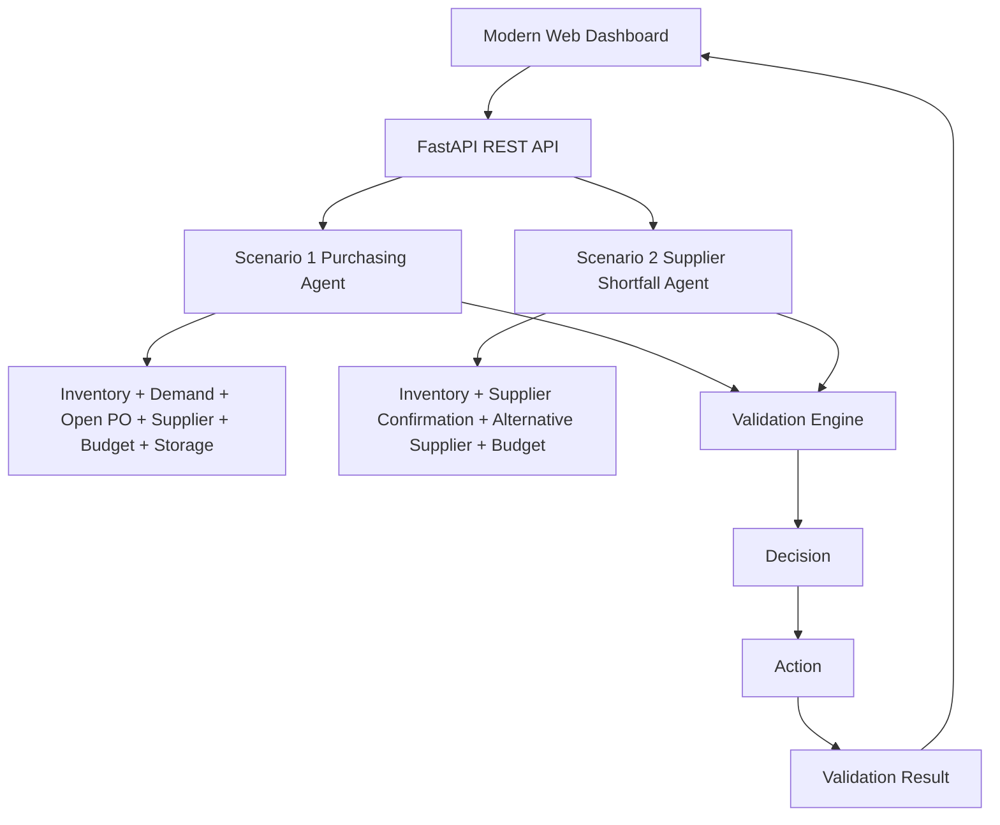

# Procura AI Architecture



## Agent decision pipeline

```text
INPUT
  ↓
INVESTIGATE DATA
  ↓
CALCULATE POSITION
  ↓
CHECK HARD CONSTRAINTS
  ↓
DECIDE
  ↓
PROPOSE ACTION
  ↓
VALIDATE
  ↓
RETURN RESULT
```

## Production evolution

The assignment is a one-day exercise, so the project intentionally uses mock data and a simple deterministic engine.

A production version could replace:
- mock data → PostgreSQL / ERP / inventory APIs
- simple rules → rules + optimization + LLM tool-calling
- direct actions → approval workflow
- console/test validation → audit logs and monitoring
